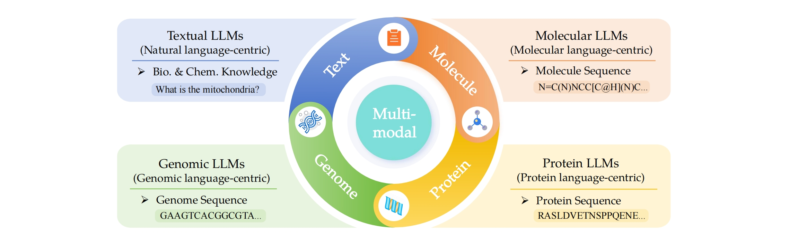

# Scientific Large Language Models (Sci-LLMs)

This repository collects papers on scientific large language models, particularly in the domains of biology and chemistry.

> 😎 Welcome to recommend missing papers through **`Adding Issues`** or **`Pull Requests`**.

## 🔔 News

- 💥 [2024/07] We have updated our survey paper by incorporating the latest related works. Please refer to the revised version on [arXiv](https://arxiv.org/abs/2401.14656/v2).

- 💥 [2024/01] Our survey paper 'Scientific Large Language Models: A Survey on Biological & Chemical Domains' has been released on [arXiv](https://arxiv.org/abs/2401.14656/v1). 


In this survey, we focus on scientific languages (i.e., textual, molecular, protein and genomic languages), as well as their combination (i.e., multimodal language).

## 🌟 Contents

- [Scientific Large Language Models (Sci-LLMs)](#scientific-large-language-models-sci-llms)
  - [🔔 News](#-news)
  - [🌟 Contents](#-contents)
  - [📖 Textual Scientific Large Language Models (Text-Sci-LLMs)](#-textual-scientific-large-language-models-text-sci-llms)
    - [Medical](#medical)
    - [Biology](#biology)
    - [Chemistry](#chemistry)
    - [Comprehensive](#comprehensive)
    - [Datasets and Benchmarks](#datasets-and-benchmarks)
  - [🧪 Molecular Large Language Models (Mol-LLMs)](#-molecular-large-language-models-mol-llms)
    - [Molecule Property Prediction](#molecule-property-prediction)
    - [Interaction Prediction](#interaction-prediction)
    - [Molecule Generation/Design/Edit](#molecule-generationdesignedit)
    - [Reaction Prediction](#reaction-prediction)
    - [Datasets and Benchmarks](#datasets-and-benchmarks-1)
  - [🧬 Protein Large Language Models (Prot-LLMs)](#-protein-large-language-models-prot-llms)
    - [Protein Sequence Representation](#protein-sequence-representation)
    - [Protein Sequence Generation/Design](#protein-sequence-generationdesign)
    - [Datasets and Benchmarks](#datasets-and-benchmarks-2)
  - [🦠 Genomic Large Language Models (Gene-LLMs)](#-genomic-large-language-models-gene-llms)
    - [General](#general)
    - [Function Prediction](#function-prediction)
    - [Variants and Evolution Prediction](#variants-and-evolution-prediction)
    - [DNA-Protein Interaction Prediction](#dna-protein-interaction-prediction)
    - [RNA Prediction](#rna-prediction)
    - [Datasets and Benchmarks](#datasets-and-benchmarks-3)
  - [Ⓜ️ Multimodal Scientific Large Language Models (MM-Sci-LLMs)](#️-multimodal-scientific-large-language-models-mm-sci-llms)
    - [Molecule\&text](#moleculetext)
    - [Protein\&text](#proteintext)
    - [Protein\&molecule](#proteinmolecule)
    - [Cell\&Text](#celltext)
    - [Comprehensive](#comprehensive-1)
    - [Datasets and Benchmarks](#datasets-and-benchmarks-4)
      - [Molecule\&Text](#moleculetext-1)
      - [Protein\&Text](#proteintext-1)
      - [Protein\&Molecule](#proteinmolecule-1)
      - [Cell\&Text](#celltext-1)
      - [Comprehensive](#comprehensive-2)
  - [👥 Contributions](#-contributions)
    - [Citation](#citation)
    - [Contributors](#contributors)
    - [Contact](#contact)

## 📖 Textual Scientific Large Language Models (Text-Sci-LLMs)

### Medical
- `2019.04` ClinicalBERT: Modeling Clinical Notes and Predicting Hospital Readmission, [arXiv](https://arxiv.org/abs/1904.05342), [Code](https://github.com/kexinhuang12345/clinicalBERT)
- `2022.02` GatorTron: A Large Clinical Language Model to Unlock Patient Information from Unstructured Electronic Health Records, [arXiv](https://arxiv.org/abs/2203.03540), [Model](https://catalog.ngc.nvidia.com/orgs/nvidia/teams/clara/models/gatortron_og)
- `2022.12` BioMedLM, [.stanford.edu](https://crfm.stanford.edu/2022/12/15/biomedlm.html), [huggingface](https://huggingface.co/stanford-crfm/BioMedLM)
- `2023.05` A Study of Generative Large Language Model for Medical Research and Healthcare (GatorTronGPT), [arXiv](https://arxiv.org/abs/2305.13523), [Code](https://github.com/uf-hobi-informatics-lab/GatorTronGPT)
- `2023.11` MEDITRON-70B: Scaling Medical Pretraining for Large Language Models, [arXiv](https://arxiv.org/abs/2311.16079), [Code](https://github.com/epfLLM/meditron)
- `2024.03` Small Language Models Learn Enhanced Reasoning Skills from Medical Textbooks (Meerkat), [arXiv](https://arxiv.org/abs/2404.00376)
- `2023.06` ClinicalGPT: Large Language Models Finetuned with Diverse Medical Data and Comprehensive Evaluation, [arXiv](https://arxiv.org/abs/2306.09968)
- `2023.10` Qilin-Med: Multi-stage Knowledge Injection Advanced Medical Large Language Model, [arXiv](https://arxiv.org/abs/2310.09089), [Code](https://github.com/williamliujl/Qilin-Med/tree/master)
- `2023.03` ChatDoctor: A Medical Chat Model Fine-Tuned on a Large Language Model Meta-AI (LLaMA) Using Medical Domain Knowledge, [arXiv](https://arxiv.org/abs/2303.14070), [Code](https://github.com/Kent0n-Li/ChatDoctor)
- `2023.04` HuaTuo: Tuning LLaMA Model with Chinese Medical Knowledge, [arXiv](https://arxiv.org/abs/2304.06975), [Code](https://github.com/SCIR-HI/Huatuo-Llama-Med-Chinese)
- `2023.05` HuatuoGPT, towards Taming Language Model to Be a Doctor, [arXiv](https://arxiv.org/abs/2305.15075), [Code](https://github.com/FreedomIntelligence/HuatuoGPT)
- `2023.04` Baize: An Open-Source Chat Model with Parameter-Efficient Tuning on Self-Chat Data, [arXiv](https://arxiv.org/abs/2304.01196), [Code](https://github.com/project-baize/baize-chatbot)
- `2023.08` Zhongjing: Enhancing the Chinese Medical Capabilities of Large Language Model through Expert Feedback and Real-world Multi-turn Dialogue, [arXiv](https://arxiv.org/abs/2308.03549), [Code](https://github.com/SupritYoung/Zhongjing)
- `2023.04` PMC-LLaMA: Towards Building Open-source Language Models for Medicine, [arXiv](https://arxiv.org/abs/2304.14454), [Code](https://github.com/chaoyi-wu/PMC-LLaMA)
- `2023.09` CPLLM: Clinical Prediction with Large Language Models, [arXiv](https://arxiv.org/abs/2309.11295), [Code](https://github.com/nadavlab/CPLLM)
- `2023.05` Towards Expert-Level Medical Question Answering with Large Language Models(Med-PaLM 2), [Google Research](https://sites.research.google/med-palm/), [arXiv](https://arxiv.org/abs/2305.09617)
- `2023.05` Clinical Camel: An Open Expert-Level Medical Language Model with Dialogue-Based Knowledge Encoding, [arXiv](https://arxiv.org/abs/2305.12031), [Code](https://github.com/bowang-lab/clinical-camel)
- `2023.04` DoctorGLM: Fine-tuning your Chinese Doctor is not a Herculean Task, [arXiv](https://arxiv.org/abs/2304.01097), [Code](https://github.com/xionghonglin/DoctorGLM)
- `2023.10` BianQue: Balancing the Questioning and Suggestion Ability of Health LLMs with Multi-turn Health Conversations Polished by ChatGPT, [arXiv](https://arxiv.org/abs/2310.15896), [Code](https://github.com/scutcyr/BianQue)
- `2024.01` Medical mT5: An Open-Source Multilingual Text-to-Text LLM for The Medical Domain, [arXiv](https://arxiv.org/abs/2404.07613)
- `2024.02` Me LLaMA: Foundation Large Language Models for Medical Applications, [arXiv](https://arxiv.org/abs/2402.12749), [Code](https://github.com/BIDS-Xu-Lab/Me-LLaMA)
- `2024.02` BiMediX: Bilingual Medical Mixture of Experts LLM, [arXiv](https://arxiv.org/abs/2402.13253), [Code](https://github.com/mbzuai-oryx/BiMediX), [Hugging Face](https://huggingface.co/BiMediX)


### Biology
- `2019.04` BioELMo: Probing Biomedical Embeddings from Language Models, [arXiv](https://arxiv.org/abs/1904.02181), [Code](https://github.com/Andy-jqa/bioelmo/)
- `2019.05` BioBERT: a pre-trained biomedical language representation model for biomedical text mining, [arXiv](https://arxiv.org/abs/1901.08746), [Code](https://github.com/dmis-lab/biobert)
- `2019.07` Transfer Learning in Biomedical Natural Language Processing: An Evaluation of BERT and ELMo on Ten Benchmarking Datasets, [arXiv](https://arxiv.org/abs/1906.05474), [Code](https://github.com/ncbi-nlp/bluebert?tab=readme-ov-file)
- `2020.10` BioMegatron: Larger Biomedical Domain Language Model, [arXiv](https://arxiv.org/abs/2010.06060), [Code](https://catalog.ngc.nvidia.com/?filters=&orderBy=weightPopularDESC&query=)
- `2020.10` Domain-Specific Language Model Pretraining for Biomedical Natural Language Processing, [arXiv](https://arxiv.org/pdf/2007.15779.pdf), [Hugging Face](https://huggingface.co/microsoft/BiomedNLP-BiomedBERT-base-uncased-abstract)
- `2021.06` BioM-Transformers: Building Large Biomedical Language Models with BERT, ALBERT and ELECTRA, [ACL Anthology](https://aclanthology.org/2021.bionlp-1.24/), [Code](https://github.com/salrowili/BioM-Transformers)
- `2022.03` LinkBERT: Pretraining Language Models with Document Links, [arXiv](https://arxiv.org/abs/2203.15827), [Code](https://github.com/salrowili/BioM-Transformers)
- `2023.03` BioGPT: Generative Pre-trained Transformer for Biomedical Text Generation and Mining, [arXiv](https://arxiv.org/abs/2210.10341), [Code](https://github.com/microsoft/BioGPT)
- `2023.08` BioMedGPT: Open Multimodal Generative Pre-trained Transformer for BioMedicine, [arXiv](https://arxiv.org/abs/2308.09442), [Code](https://github.com/PharMolix/OpenBioMed?tab=readme-ov-file)
- `2023.09` BioinspiredLLM: Conversational Large Language Model for the Mechanics of Biological and Bio-Inspired Materials, [arXiv](https://arxiv.org/abs/2309.08788)
- `2024.02` BioMistral: BioMistral: A Collection of Open-Source Pretrained Large Language Models for Medical Domains, [arXiv](https://arxiv.org/abs/2402.10373), [Code](https://github.com/BioMistral/BioMistral)
  
### Chemistry

- `2021.06` Automated Chemical Reaction Extraction from Scientific Literature. [Journal of Chemical Information and Modeling](https://pubs.acs.org/doi/abs/10.1021/acs.jcim.1c00284), [Code](https://github.com/jiangfeng1124/ChemRxnExtractor)
- `2021.09` MatSciBERT: A materials domain language model for text mining and information extraction, [npj Computational Materials](https://www.nature.com/articles/s41524-022-00784-w), [Code](https://github.com/M3RG-IITD/MatSciBERT?tab=readme-ov-file)
- `2022.09` A general-purpose material property data extraction pipeline from large polymer corpora using natural language processing, [npj Computational Materials](https://www.nature.com/articles/s41524-023-01003-w), [Hugging Face](https://huggingface.co/pranav-s/MaterialsBERT)
- `2024.01` ChemDFM: Dialogue Foundation Model for Chemistry, [arXiv](https://arxiv.org/abs/2402.10373), [Model](https://huggingface.co/OpenDFM/ChemDFM-13B-v1.0)
- `2024.02` ChemLLM: A Chemical Large Language Model, [arXiv](https://arxiv.org/abs/2402.06852), [Model](https://huggingface.co/AI4Chem/ChemLLM-7B-Chat)
- `2024.02` LlaSMol: Advancing Large Language Models for Chemistry with a Large-Scale, Comprehensive, High-Quality Instruction Tuning Dataset,  [arXiv](https://arxiv.org/abs/2402.09391), [Page](https://osu-nlp-group.github.io/LLM4Chem/), [Model](https://huggingface.co/osunlp/LlaSMol-Mistral-7B), [Dataset](https://huggingface.co/datasets/osunlp/SMolInstruct)
- `2024.02` PharmaGPT: Domain-Specific Large Language Models for Bio-Pharmaceutical and Chemistry, [arXiv](https://arxiv.org/pdf/2406.18045v2)


### Comprehensive

- `2019.09` SciBERT: A Pretrained Language Model for Scientific Text, [arXiv](https://arxiv.org/abs/1903.10676), [Code](https://github.com/allenai/scibert/)
- `2023.05` The Diminishing Returns of Masked Language Models to Science, [arXiv](https://arxiv.org/abs/2205.11342), [Hugging Face](https://huggingface.co/globuslabs/ScholarBERT)
- `2023.08` DARWIN Series: Domain Specific Large Language Models for Natural Science, [arXiv](https://arxiv.org/abs/2308.13565), [Code](https://github.com/MasterAI-EAM/Darwin)
- `2024.01` SciGLM: Training Scientific Language Models with Self-Reflective Instruction Annotation and Tuning, [arXiv](https://arxiv.org/abs/2401.07950), [GitHub](https://github.com/THUDM/SciGLM)
- `2024.03` Uni-SMART: Universal Science Multimodal Analysis and Research Transformer, [arXiv](https://arxiv.org/abs/2403.10301)
- `2024.05` INDUS: Effective and Efficient Language Models for Scientific Applications,[arXiv](https://arxiv.org/abs/2405.10725)
- `2024.09` SciDFM: A Large Language Model with Mixture-of-Experts for Science, [arXiv](https://arxiv.org/pdf/2409.18412), [Code](https://huggingface.co/OpenDFM/SciDFM-MoE-A5.6B-v1.0)

  
### Datasets and Benchmarks

- [The MIMIC dataset](https://mimic.mit.edu/), `2016.05`. [mimic-code](https://github.com/MIT-LCP/mimic-code), Data Descriptor: MIMIC-III, a freely accessible critical care database, [Scientific Data](https://www.nature.com/articles/sdata201635.pdf)
- [eICU-CRD](https://physionet.org/content/eicu-crd/2.0/). `2019.04`. The eICU Collaborative Research Database, a freely available multi-center database for critical care research, [Scientific Data](https://www.nature.com/articles/sdata2018178)
- [cMedQA2](https://github.com/zhangsheng93/cMedQA2?tab=readme-ov-file), `2018.11`. Multi-Scale Attentive Interaction Networks for Chinese Medical Question Answer Selection, [IEEE Access](https://ieeexplore.ieee.org/abstract/document/8548603)
- [MedDialog-Chinese](https://tianchi.aliyun.com/dataset/92110). MedDialog: Large-scale Medical Dialogue Datasets, [EMNLP 2020](https://aclanthology.org/2020.emnlp-main.743/)
- [ChiMed](https://huggingface.co/datasets/williamliu/ChiMed/tree/main). `2023.10`. Qilin-Med: Multi-stage Knowledge Injection Advanced Medical Large Language Model, [arXiv](https://arxiv.org/abs/2310.09089v2)
- [HealthCareMagic-100k](www.healthcaremagic.com), `2023.03`. ChatDoctor: A Medical Chat Model Fine-Tuned on a Large Language Model Meta-AI (LLaMA) Using Medical Domain Knowledge, [arXiv](https://arxiv.org/abs/2303.14070)
- [MedQuAD](https://github.com/abachaa/MedQuAD), `2019.01`. A Question-Entailment Approach to Question Answering, [arXiv](https://arxiv.org/abs/1901.08079v1)
- [MultiMedQA](https://www.nature.com/articles/s41586-023-06291-2), `2023.07`. Large language models encode clinical knowledge, [Nature](https://www.nature.com/articles/s41586-023-06291-2)
- [Open-I](https://openi.nlm.nih.gov/), `2015.07`. Preparing a collection of radiology examinations for distribution and retrieval, [JAMIA](https://academic.oup.com/jamia/article/23/2/304/2572395?login=false)
- [Psych8k](https://huggingface.co/datasets/EmoCareAI/Psych8k), `2024.03`. ChatCounselor: A Large Language Models for Mental Health Support, [arXiv](https://arxiv.org/abs/2309.15461)
- [CMD. dataset](https://github.com/Toyhom/Chinese-medical-dialogue-data), `2019.09`. DoctorGLM: Fine-tuning your Chinese Doctor is not a Herculean Task, [arXiv](https://arxiv.org/abs/2304.01097)
- [BianQueCorpus](https://github.com/scutcyr/BianQue), `2023.10`. BianQue: Balancing the Questioning and Suggestion Ability of Health LLMs with Multi-turn Health Conversations Polished by ChatGPT, [arXiv](https://arxiv.org/abs/2310.15896)
- [MedQA-USMLE](https://github.com/jind11/MedQA), `2021.04`. What Disease does this Patient Have? A Large-scale Open Domain Question Answering Dataset from Medical Exams, [arXiv](https://arxiv.org/abs/2009.13081)
- [MedMCQA](https://github.com/medmcqa/medmcqa), `2022.03`. MedMCQA : A Large-scale Multi-Subject Multi-Choice Dataset for Medical domain Question Answering, [arXiv](https://arxiv.org/abs/2203.14371)
- [JAMA Clinical Challenge dataset](https://github.com/HanjieChen/ChallengeClinicalQA), `2024.05`. Benchmarking Large Language Models on Answering and Explaining Challenging Medical Questions, [arXiv](https://arxiv.org/abs/2402.18060)
- [CMtMedQA](https://huggingface.co/datasets/Suprit/CMtMedQA), `2023.08`. Zhongjing: Enhancing the Chinese Medical Capabilities of Large Language Model through Expert Feedback and Real-world Multi-turn Dialogue, [arXiv](https://arxiv.org/abs/2308.03549)
- [huatuo-26M](https://github.com/FreedomIntelligence/Huatuo-26M), `2023.05`. Huatuo-26M, a Large-scale Chinese Medical QA Dataset, [arXiv](https://arxiv.org/abs/2305.01526)
- [MMLU](https://huggingface.co/datasets/cais/mmlu), `2020.09`. Measuring Massive Multitask Language Understanding, [arXiv](https://arxiv.org/abs/2009.03300)
- [C-Eval](https://huggingface.co/datasets/ceval/ceval-exam), `2023.05`. C-Eval: A Multi-Level Multi-Discipline Chinese Evaluation Suite for Foundation Models, [arXiv](https://arxiv.org/abs/2305.08322)
- [AGIEval](https://huggingface.co/datasets/baber/agieval) `2023.05`. AGIEval: A Human-Centric Benchmark for Evaluating Foundation Models, [arXiv](https://arxiv.org/abs/2304.06364)
- [ScienceQA](https://huggingface.co/datasets/derek-thomas/ScienceQA), 2022.09. Learn to Explain: Multimodal Reasoning via Thought Chains for Science Question Answering, [arXiv](https://arxiv.org/abs/2209.09513)
- [Xiezhi](https://github.com/MikeGu721/XiezhiBenchmark), `2023.06`. Xiezhi: An Ever-Updating Benchmark for Holistic Domain Knowledge Evaluation, [arXiv](https://arxiv.org/abs/2306.05783)
- [SciEval](https://github.com/OpenDFM/SciEval), `2023.08`. SciEval: A Multi-Level Large Language Model Evaluation Benchmark for Scientific Research, [arXiv](https://arxiv.org/abs/2308.13149)
- [Bioinfo-Bench](https://github.com/cinnnna/bioinfo-bench), `2023.10`. A Simple Benchmark Framework for LLM Bioinformatics Skills Evaluation, [bioRxiv](https://www.bioRxiv.org/content/10.1101/2023.10.18.563023v1.abstract)
- [BLURB](https://huggingface.co/datasets/EMBO/BLURB), `2020.07`. Domain-Specific Language Model Pretraining for Biomedical Natural Language Processing, [arXiv](https://arxiv.org/abs/2007.15779)
- [ARC](https://huggingface.co/datasets/allenai/ai2_arc), `2018.03`. Think you have Solved Question Answering? Try ARC, the AI2 Reasoning Challenge, [arXiv](https://arxiv.org/abs/1803.05457)
- [SciQ](https://huggingface.co/datasets/sciq), `2017.07`. Crowdsourcing Multiple Choice Science Questions, [arXiv](https://arxiv.org/abs/1707.06209v1)

## 🧪 Molecular Large Language Models (Mol-LLMs)

### Molecule Property Prediction

- `2019.09` SMILES-BERT: Large Scale Unsupervised Pre-Training for Molecular Property Prediction, [ACM-BCB](https://dl.acm.org/doi/10.1145/3307339.3342186), [Code](https://github.com/uta-smile/SMILES-BERT)
- `2019.11` SMILES Transformer: Pre-trained Molecular Fingerprint for Low Data Drug Discovery, [arXiv](https://arxiv.org/abs/1911.04738v1), [Code](https://github.com/DSPsleeporg/smiles-transformer)
- `2020.02` Molecule attention transformer, [arXiv](http://arxiv.org/abs/2002.08264), [Code](https://github.com/ardigen/MAT)
- `2020.10` ChemBERTa: Large-Scale Self-Supervised Pretraining for Molecular Property Prediction, [arXiv](http://arxiv.org/abs/2010.09885), [Code](https://huggingface.co/seyonec/ChemBERTa-zinc-base-v1)
- `2020.10` Self-Supervised Graph Transformer on Large-Scale Molecular Data, [arXiv](http://arxiv.org/abs/2007.02835), [Code](https://github.com/tencent-ailab/grover)
- `2020.11` Language models in molecular discovery, [NeurIPS](https://arxiv.org/abs/2011.13230), [Code](https://github.com/BenevolentAI/MolBERT)
- `2021.05` MG-BERT: leveraging unsupervised atomic representation learning for molecular property prediction, [Briefings in Bioinformatics](https://www.researchgate.net/publication/351363304_MG-BERT_leveraging_unsupervised_atomic_representation_learning_for_molecular_property_prediction), [Code](https://github.com/zhang-xuan1314/Molecular-graph-BERT)
- `2021.06` Algebraic graph-assisted bidirectional transformers for molecular property prediction, [Nature Communications](https://www.nature.com/articles/s41467-021-23720-w), [Code](https://github.com/ChenDdon/AGBTcode)
- `2021.09` Mol-BERT: An Effective Molecular Representation with BERT for Molecular Property Prediction, [Wireless Communications and Mobile Computing](https://www.hindawi.com/journals/wcmc/2021/7181815/), [Code](https://github.com/cxfjiang/MolBERT)
- `2021.10` Relative molecule self-attention transformer, [Journal of Cheminformatics](https://link.springer.com/article/10.1186/s13321-023-00789-7), [Code](https://github.com/gmum/huggingmolecules) 
- `2022.08` KPGT: Knowledge-Guided Pre-training of Graph Transformer for Molecular Property Prediction, [Proceedings of the 28th ACM SIGKDD Conference on Knowledge Discovery and Data Mining](https://dl.acm.org/doi/10.1145/3534678.3539426), [Code](https://github.com/lihan97/KPGT)
- `2022.09` ChemBERTa-2: Towards Chemical Foundation Models, [arXiv](http://arxiv.org/abs/2209.01712), [Code](https://huggingface.co/seyonec/ChemBERTa-zinc-base-v1)
- `2022.01` Chemformer: a pre-trained transformer for computational chemistry, [Mach. Learn.: Sci. Technol.](https://iopscience.iop.org/article/10.1088/2632-2153/ac3ffb/meta), [Code](https://github.com/MolecularAI/Chemformer)
- `2022.10` Large-Scale Distributed Training of Transformers for Chemical Fingerprinting, [JCIM](https://doi.org/10.1021/acs.jcim.2c00715), [Code](https://github.com/GouldGroup/MFBERT)
- `2022.11` BARTSmiles: Generative Masked Language Models for Molecular Representations, [arXiv](https://arxiv.org/abs/2211.16349), [Code](https://github.com/YerevaNN/BARTSmiles/)
- `2022.12` Large-Scale Chemical Language Representations Capture Molecular Structure and Properties, [arXiv](http://arxiv.org/abs/2106.09553), [Code](https://github.com/IBM/molformer)
- `2022.12` Pushing the Boundaries of Molecular Property Prediction for Drug Discovery with Multitask Learning BERT Enhanced by SMILES Enumeration, [Research](https://spj.science.org/doi/10.34133/research.0004), [Code](https://github.com/zhang-xuan1314/MTL-BERT)
- `2023.01` MolRoPE-BERT: An enhanced molecular representation with Rotary Position Embedding for molecular property prediction, [Journal of Molecular Graphics and Modelling](https://linkinghub.elsevier.com/retrieve/pii/S1093326322002236)
- `2023.01` Molformer: Motif-based Transformer on 3D Heterogeneous Molecular Graphs, [arXiv](http://arxiv.org/abs/2110.01191), [Code](https://github.com/smiles724/Molformer)
- `2023.02` UNI-MOL: A UNIVERSAL 3D MOLECULAR REPRESENTATION LEARNING FRAMEWORK, [NeurIPS](https://chemrxiv.org/engage/chemrxiv/article-details/6402990d37e01856dc1d1581), [Code](https://github.com/dptech-corp/Uni-Mol)
- `2023.05` SELFORMER: MOLECULAR REPRESENTATION LEARNING VIA SELFIES LANGUAGE MODELS, [arXiv](http://arxiv.org/abs/2304.04662), [Code](https://github.com/HUBioDataLab/SELFormer)
- `2023.07` Molecular Descriptors Property Prediction Using Transformer-Based Approach, [IJMS](https://www.mdpi.com/1422-0067/24/15/11948)
- `2023.10` GTMGC: USING GRAPH TRANSFORMER TO PREDICT MOLECULE’S GROUND-STATE CONFORMATION, [ICLR](https://openreview.net/forum?id=F7QnIKlC1N)

### Interaction Prediction

- `2020.12` X-MOL: large-scale pre-training for molecular understanding and diverse molecular analysis, [bioRxiv](https://www.bioRxiv.org/content/10.1101/2020.12.23.424259v2.full), [Code](https://github.com/bm2-lab/X-MOL)

### Molecule Generation/Design/Edit

- `2021.05` MolGPT: Molecular Generation Using a Transformer-Decoder Model, [JCIM](https://pubs.acs.org/doi/abs/10.1021/acs.jcim.1c00600), [Code](https://github.com/devalab/molgpt)
- `2021.07` Transmol: repurposing a language model for molecular generation, [RSC Advances](https://pubs.rsc.org/en/content/articlelanding/2021/ra/d1ra03086h), [Code](https://gitlab.com/cheml.io/public/transmol)
- `2021.09` GENERATIVE PRE-TRAINING FROM MOLECULES, [ChemRxiv](https://chemrxiv.org/engage/api-gateway/chemrxiv/assets/orp/resource/item/6142f60742198e8c31782e9e/original/generative-pre-training-from-molecules.pdf), [Code](https://github.com/sanjaradylov/smiles-gpt)
- `2021.12` Generative Chemical Transformer: Neural Machine Learning of Molecular Geometric Structures from Chemical Language via Attention, [JCIM](https://pubs.acs.org/doi/10.1021/acs.jcim.1c01289), [Code](https://github.com/Hyunseung-Kim/molGCT)
- `2022.10` A Pre-trained Conditional Transformer for Target-specific De Novo Molecular Generation, [arXiv](http://arxiv.org/abs/2210.08749)
- `2023.05` iupacGPT: IUPAC-based large-scale molecular pre-trained model for property prediction and molecule generation, [ChemRxiv](https://chemrxiv.org/engage/chemrxiv/article-details/645f49f9a32ceeff2d90c9ae), [Code](https://github.com/AspirinCode/iupacGPT)
- `2023.05` cMolGPT: A Conditional Generative Pre-Trained Transformer for Target-Specific De Novo Molecular Generation, [Molecules](https://www.mdpi.com/1420-3049/28/11/4430), [Code](https://github.com/VV123/cMolGPT)
- `2023.05` Molecule generation using transformers and policy gradient reinforcement learning, [Scientific Reports](https://www.nature.com/articles/s41598-023-35648-w), [Code](https://github.com/eyalmazuz/MolGen)
- `2023.10` DOMAIN-AGNOSTIC MOLECULAR GENERATION WITH SELF-FEEDBACK, [arXiv](https://arxiv.org/abs/2301.11259v5), [Code](https://github.com/zjunlp/MolGen)

### Reaction Prediction

- `2019.08` Molecular Transformer: A Model for Uncertainty-Calibrated Chemical Reaction Prediction, [ACS Cent. Sci.](https://doi.org/10.1021/acscentsci.9b00576), [Code](https://github.com/pschwllr/MolecularTransformer)
- `2019.08` Molecular Transformer unifies reaction prediction and retrosynthesis across pharma chemical space, [Chemical Communications](http://xlink.rsc.org/?DOI=C9CC05122H)
- `2019.09` A Transformer Model for Retrosynthesis, [ICANN](http://link.springer.com/10.1007/978-3-030-30493-5_78), [Code](https://github.com/bigchem/retrosynthesis)
- `2019.12` Predicting Retrosynthetic Reaction using Self-Corrected Transformer Neural Networks, [arXiv](https://arxiv.org/abs/1907.01356), [Code](https://github.com/Jh-SYSU/SCROP)
- `2020.11` State-of-the-art augmented NLP transformer models for direct and single-step retrosynthesis, [Nature Communications](https://www.nature.com/articles/s41467-020-19266-y), [Code](https://github.com/bigchem/synthesis)
- `2021.01` Valid, Plausible, and Diverse Retrosynthesis Using Tied Two-Way Transformers with Latent Variables, [JCIM](https://pubs.acs.org/doi/10.1021/acs.jcim.0c01074), [Code](https://github.com/ejklike/tied-twoway-transformer/)
- `2021.01` Prediction of chemical reaction yields using deep learning, [Mach. Learn.: Sci. Technol.](https://iopscience.iop.org/article/10.1088/2632-2153/abc81d), [Code](https://rxn4chemistry.github.io/rxn_yields/)
- `2021.03` Predicting Chemical Reaction Outcomes: A Grammar Ontology-based Transformer Framework, [AIChE Journal](https://aiche.onlinelibrary.wiley.com/doi/10.1002/aic.17190)
- `2021.10` Molecular Graph Enhanced Transformer for Retrosynthesis Prediction, [Neurocomputing](https://www.sciencedirect.com/science/article/pii/S0925231221009413), [Code](https://github.com/papercodekl/MolecularGET)
- `2021.10` PERMUTATION INVARIANT GRAPH-TO-SEQUENCE MODEL FOR TEMPLATE-FREE RETROSYNTHESIS AND REACTION PREDICTION, [arXiv](https://arxiv.org/abs/2110.09681), [Code](https://github.com/coleygroup/Graph2SMILES)
- `2022.03` Retrosynthetic reaction pathway prediction through neural machine translation of atomic environments, [Nature Communications](https://www.nature.com/articles/s41467-022-28857-w), [Code](https://github.com/knu-lcbc/RetroTRAE)
- `2023.02` Enhancing diversity in language based models for single-step retrosynthesis, [Digital Discovery](http://xlink.rsc.org/?DOI=D2DD00110A), [Code](https://github.com/rxn4chemistry/rxn_cluster_token_prompt)
- `2023.07` Unbiasing Retrosynthesis Language Models with Disconnection Prompts, [ACS Cent. Sci.](https://doi.org/10.1021/acscentsci.3c00372), [Code](https://github.com/rxn4chemistry/disconnection_aware_retrosynthesis)

### Datasets and Benchmarks

- [ZINC 15](https://ZINC15.docking.org/), `2015.10` ZINC 15 – Ligand Discovery for Everyone, [JCIM](https://pubs.acs.org/doi/full/10.1021/acs.jcim.5b00559)
- [ZINC 20](https://zinc20.docking.org/), `2020.12` ZINC20—A Free Ultralarge-Scale Chemical Database for Ligand Discovery, [JCIM](https://pubs.acs.org/doi/full/10.1021/acs.jcim.5b00559)
- [ZINC-250k](https://figshare.com/articles/dataset/ZINC_250K_data_sets/17122427/1), `2012.07` ZINC − A Free Database of Commercially Available Compounds for Virtual Screening, [JCIM](https://pubs.acs.org/doi/10.1021/ci049714%2B?ref=PDF)
- [PubChem](https://pubchem.ncbi.nlm.nih.gov/), `2023.01` PubChem 2023 update, [Nucleic Acids Research](https://doi.org/10.1093/nar/gkac956)
- [USPTO](https://developer.uspto.gov/data), [USPTO MIT](https://github.com/wengong-jin/nips17-rexgen), [USPTO-15K](https://github.com/connorcoley/ochem_predict_nn), [USPTO-full](https://github.com/dan2097/patent-reaction-extraction), `2012.10` Extraction of chemical structures and reactions from the literature, [University of Cambridge](http://www.dspace.cam.ac.uk/handle/1810/244727)
- [PCQM4Mv2](https://ogb.stanford.edu/docs/lsc/pcqm4mv2/), `2021.10` OGB-LSC: A Large-Scale Challenge for Machine Learning on Graphs, [arXiv](http://arxiv.org/abs/2103.09430)
- [PCQM4M-LSC](https://ogb.stanford.edu/kddcup2021/pcqm4m/), `2021.06` First Place Solution of KDD Cup 2021 & OGB Large-Scale Challenge Graph Prediction Track, [arXiv](http://arxiv.org/abs/2106.08279)
- [GEOM](https://www.aicures.mit.edu/), `2022.04` GEOM, energy-annotated molecular conformations for property prediction and molecular generation, [Nature](https://www.nature.com/articles/s41597-022-01288-4)
- [ToyMix, LargeMix, UltraLarge](https://zenodo.org/record/8372621), `2023.10` Towards Foundational Models for Molecular Learning on Large-Scale Multi-Task Datasets, [arXiv](https://arxiv.org/pdf/2310.04292v2.pdf)
- [ChEMBL](https://www.ebi.ac.uk/chembl/), `2023.05` The ChEMBL Database in 2023: a drug discovery platform spanning multiple bioactivity data types and time periods, [Nucleic Acids Research](https://academic.oup.com/nar/advance-article/doi/10.1093/nar/gkad1004/7337608)
- [DrugBank 5.0](https://go.drugbank.com/), `2017.11` DrugBank 5.0: a major update to the DrugBank database for 2018, [Nucleic Acids Research](https://academic.oup.com/nar/article/46/D1/D1074/4602867?login=false)
- [GDB-17](https://gdb.unibe.ch/downloads/), `2012.10` Enumeration of 166 Billion Organic Small Molecules in the Chemical Universe Database GDB-17, [JCIM](https://pubs.acs.org/doi/10.1021/ci300415d)
- [ExCAPE-DB](https://pubchem.ncbi.nlm.nih.gov/), `2017.03` ExCAPE-DB: an integrated large scale dataset facilitating Big Data analysis in chemogenomics, [Journal of Cheminformatics](https://doi.org/10.1186/s13321-017-0203-5)
- [MoleculeNet](https://github.com/deepchem/deepchem), `2017.10` MoleculeNet: a benchmark for molecular machine learning, [Chemical Science](https://pubs.rsc.org/en/content/articlelanding/2018/sc/c7sc02664a)
- [MARCEL](https://github.com/SXKDZ/MARCEL), `2023.09` Learning Over Molecular Conformer Ensembles: Datasets and Benchmarks, [arXiv](https://arxiv.org/abs/2310.00115v1)
- [GuacaMol](https://benevolent.ai/guacamol), `2019.03` GuacaMol: Benchmarking Models for de Novo Molecular Design, [JCIM](https://pubs.acs.org/doi/10.1021/acs.jcim.8b00839?ref=PDF)
- [MOSES](https://github.com/molecularsets/moses), `2020.12` Molecular Sets (MOSES): A Benchmarking Platform for Molecular Generation Models, [Frontiers in Pharmacology](https://www.frontiersin.org/articles/10.3389/fphar.2020.565644/full)
- [ADMETlab 2.0](https://admet.scbdd.com/), `2021.04` ADMETlab 2.0: an integrated online platform for accurate and comprehensive predictions of ADMET properties, [Nucleic Acids Research](https://www.ncbi.nlm.nih.gov/pmc/articles/PMC8262709/)
- [SPECTRA](https://github.com/mims-harvard/SPECTRA), `2024.02` Evaluating generalizability of artificial intelligence models for molecular datasets, [bioRxiv](https://www.biorxiv.org/content/10.1101/2024.02.25.581982v1)
- [Molecule3D](https://github.com/divelab/MoleculeX), `2021.09` Molecule3D: A Benchmark for Predicting 3D Geometries from Molecular Graphs, [arXiv](https://arxiv.org/abs/2110.01717)

## 🧬 Protein Large Language Models (Prot-LLMs)

### Protein Sequence Representation

- `2020.02` Biological Structure and Function Emerge from Scaling Unsupervised Learning to 250 Million Protein Sequences, [PNAS](https://www.bioRxiv.org/content/10.1101/622803v4), [Code](https://github.com/facebookresearch/esm)
- `2021.02` MSA transformer, [PMLR](http://proceedings.mlr.press/v139/rao21a.html), [Code](https://github.com/facebookresearch/esm)
- `2021.02` Multi-scale representation learning on proteins, [Neurips](https://proceedings.neurips.cc/paper_files/paper/2021/hash/d494020ff8ec181ef98ed97ac3f25453-Abstract.html)
- `2021.02` Language models enable zero-shot prediction of the effects of mutations on protein function, [Neurips](https://proceedings.neurips.cc/paper_files/paper/2021/hash/f51338d736f95dd42427296047067694-Abstract.html), [Code](https://github.com/facebookresearch/esm)
- `2021.07` ProtTrans: Toward Understanding the Language of Life Through Self-Supervised Learning, [IEEE Transactions on Pattern Analysis and Machine Intelligence](https://ieeexplore.ieee.org/abstract/document/9477085/), [Code](https://github.com/agemagician/ProtTrans)
- `2021.07` Pre-training Co-evolutionary Protein Representation via A Pairwise Masked Language Model, [CoRR](https://arxiv.org/abs/2110.15527)
- `2021.09` Toward more general embeddings for protein design: Harnessing joint representations of sequence and structure, [bioRxiv](https://www.bioRxiv.org/content/10.1101/2021.09.01.458592.abstract)
- `2022.02` ProteinBERT: a universal deep-learning model of protein sequence and function, [bioRxiv](https://academic.oup.com/bioinformatics/article-abstract/38/8/2102/6502274), [Code](https://github.com/nadavbra/protein_bert)
- `2022.04` Lm-gvp: an extensible sequence and structure informed deep learning framework for protein property prediction, [bioRxiv](https://www.bioRxiv.org/content/10.1101/2023.02.22.529597v1), [Code](https://github.com/aws-samples/lm-gvp)
- `2022.05` Retrieved Sequence Augmentation for Protein Representation Learning, [bioRxiv](https://www.bioRxiv.org/content/10.1101/622803v4), [Code](https://github.com/HKUNLP/RSA)
- `2022.06` OntoProtein: Protein Pretraining With Gene Ontology Embedding, [arXiv](https://ui.adsabs.harvard.edu/abs/2022arXiv220111147Z), [Code](https://github.com/zjunlp/OntoProtein)
- `2022.07` Language models of protein sequences at the scale of evolution enable accurate structure prediction, [bioRxiv](https://doi.org/10.1101/2022.07.20.500902), [Code](https://github.com/facebookresearch/esm)
- `2023.02` Multi-level Protein Structure Pre-training via Prompt Learning, [ICLR](https://openreview.net/forum?id=XGagtiJ8XC), [Code](https://github.com/HICAI-ZJU/PromptProtein)
- `2023.02` Protein Representation Learning via Knowledge Enhanced Primary Structure Modeling, [arXiv](https://ui.adsabs.harvard.edu/abs/2023arXiv230113154Z), [Code](https://github.com/RL4M/KeAP)
- `2023.10` Deciphering the protein landscape with ProtFlash, a lightweight language model, [bioRxiv](https://doi.org/10.1016/j.xcrp.2023.101600), [Code](https://github.com/ISYSLAB-HUST/ProtFlash)
- `2023.10` Enhancing protein language models with structure-based encoder and pre-training, [arXiv](https://arxiv.org/abs/2303.06275), [Code](https://github.com/DeepGraphLearning/ESM-GearNet)
- `2023.10` Saprot: Protein language modeling with structure-aware vocabulary, [bioRxiv](https://www.bioRxiv.org/content/10.1101/2023.10.01.560349v2.abstract), [Code](https://github.com/westlake-repl/SaProt)
- `2023.12` ProteinNPT: Improving Protein Property Prediction and Design with Non-Parametric Transformers, [bioRxiv](https://www.bioRxiv.org/content/early/2023/12/07/2023.12.06.570473)
- `2024.02` Codon language embeddings provide strong signals for use in protein engineering, [Nature Machine Intelligence](https://www.nature.com/articles/s42256-024-00791-0#data-availability), [Code](https://github.com/oxpig/CaLM)
- `2024.04` Pre-training Sequence, Structure, and Surface Features for Comprehensive Protein Representation Learning, [ICLR](https://openreview.net/forum?id=BEH4mGo7zP)
- `2024.06` ESM All-Atom: Multi-scale Protein Language Model for Unified Molecular Modeling, [bioRxiv](https://www.biorxiv.org/content/10.1101/2024.03.04.583284v3.abstract)
- `2024.06` Knowledge-aware Reinforced Language Models for Protein Directed Evolution, [ICML](https://openreview.net/pdf?id=MikandLqtW)
- `2024.06` Simulating 500 million years of evolution with a language model, [bioRxiv](https://evolutionaryscale-public.s3.us-east-2.amazonaws.com/research/esm3.pdf), [Code](https://github.com/evolutionaryscale/esm)

### Protein Sequence Generation/Design

- `2020.03` ProGen: Language Modeling for Protein Generation, [arXiv](https://doi.org/10.48550/arXiv.2004.03497), [Code](https://github.com/salesforce/progen)
- `2021.01` A deep unsupervised language model for protein design, [bioRxiv](https://www.bioRxiv.org/content/early/2022/03/12/2022.03.09.483666), [Code](https://huggingface.co/nferruz/ProtGPT2)
- `2021.01` Fold2seq: A joint sequence (1d)-fold (3d) embedding-based generative model for protein design, [PMLR](https://proceedings.mlr.press/v139/cao21a.html), [Code](https://github.com/IBM/fold2seq)
- `2022.01` ZymCTRL: a conditional language model for the controllable generation of artificial enzymes, [NeurIPS](https://www.mlsb.io/papers_2022/ZymCTRL_a_conditional_language_model_for_the_controllable_generation_of_artificial_enzymes.pdf), [Code](https://huggingface.co/AI4PD/ZymCTRL)
- `2022.04` Few Shot Protein Generation, [arXiv](https://arxiv.org/abs/2204.01168)
- `2022.05` RITA: a Study on Scaling Up Generative Protein Sequence Models, [arXiv]([https://doi.org/10.48550/arXiv.2004.03497](https://ui.adsabs.harvard.edu/abs/2022arXiv220505789H))
- `2022.12` Generative language modeling for antibody design, [arXiv](https://www.bioRxiv.org/content/10.1101/2021.12.13.472419.abstract), [Code](https://github.com/Graylab/IgLM)
- `2023.02` Structure-informed Language Models Are Protein Designers, [bioRxiv](https://www.bioRxiv.org/content/early/2023/02/09/2023.02.03.526917)
- `2023.02` Generative power of a protein language model trained on multiple sequence alignments, [Elife](https://elifesciences.org/articles/79854), [Code](https://doi.org/10.5281/zenodo.7684052)
- `2023.02` Protein sequence design in a latent space via model-based reinforcement learning, [ICLR](https://openreview.net/forum?id=OhjGzRE5N6o)
- `2023.06` Enhancing the Protein Tertiary Structure Prediction by Multiple Sequence Alignment Generation, [arXiv](https://ui.adsabs.harvard.edu/abs/2023arXiv230601824Z), [Code](https://github.com/Magiccircuit/MSA-Augmentor)
- `2023.07` ProstT5: Bilingual Language Model for Protein Sequence and Structure, [bioRxiv](https://www.bioRxiv.org/content/early/2023/07/25/2023.07.23.550085), [Code](https://github.com/mheinzinger/ProstT5)
- `2023.07` xTrimoPGLM: unified 100B-scale pre-trained transformer for deciphering the language of protein, [bioRxiv](https://www.bioRxiv.org/content/10.1101/2023.07.05.547496.abstract)
- `2023.08` Efficient and accurate sequence generation with small-scale protein language models, [bioRxiv](https://www.bioRxiv.org/content/10.1101/2023.08.04.551626.abstract)
- `2023.10` Generative Antibody Design for Complementary Chain Pairing Sequences through Encoder-Decoder Language Model, [NeurIPS](https://openreview.net/forum?id=QrH4bhWhwY)
- `2023.10` ProGen2: exploring the boundaries of protein language models, [Cell](https://www.cell.com/cell-systems/pdf/S2405-4712(23)00272-7.pdf), [Code](https://github.com/salesforce/progen)
- `2023.10` ProteinRL: Reinforcement learning with generative protein language models for property-directed sequence design, [NeurIPS](https://openreview.net/forum?id=sWCsSKqkXa)
- `2023.11` PoET: A generative model of protein families as sequences-of-sequences, [arXiv](https://arxiv.org/abs/2306.06156)
- `2024.03` Protein Discovery with Discrete Walk-Jump Sampling, [arxiv](https://arxiv.org/abs/2306.12360).

### Datasets and Benchmarks

- [UniRef100, 90, 50](https://www.uniprot.org/uniref?query=*), `2007.03` UniRef: comprehensive and non-redundant UniProt reference clusters, [Bioinformatics](https://academic.oup.com/bioinformatics/article-abstract/23/10/1282/197795)
- [UniProtKB/Swiss-Prot](https://www.uniprot.org/uniprotkb?query=*), `2016.01` UniProtKB/Swiss-Prot, the manually annotated section of the UniProt KnowledgeBase: how to use the entry view, [Springer Plant Bioinformatics](https://link.springer.com/protocol/10.1007/978-1-4939-3167-5_2)
- [UniProtKB/TrEMBL](https://www.uniprot.org/uniprotkb?query=*), `1999.03` EDITtoTrEMBL: a distributed approach to high-quality automated protein sequence annotation, [Bioinformatics](https://link.springer.com/protocol/10.1007/978-1-4939-3167-5_2)
- [UniParc](https://www.uniprot.org/uniparc?query=*), `2022.11` UniProt: the Universal Protein Knowledgebase in 2023, [Bioinformatics](https://doi.org/10.1093/nar/gkac1052)
- [Pfam](https://www.ebi.ac.uk/interpro/entry/pfam/), `1999.03` Pfam: clans, web tools and services, [Nucleic Acids Research](https://academic.oup.com/nar/article-abstract/34/suppl_1/D247/1133922)
- [BFD](https://bfd.mmseqs.com/), `2018.06` Clustering huge protein sequence sets in linear time, [Nature Communications](https://www.nature.com/articles/s41467-018-04964-5)
- [PDB](https://www.rcsb.org/), `2018.10` Protein Data Bank: the single global archive for 3D macromolecular structure data, [Nucleic Acids Research](https://doi.org/10.1093/nar/gky949)
- [AlphaFoldDB](https://alphafold.ebi.ac.uk/), `2021.11` AlphaFold Protein Structure Database: massively expanding the structural coverage of protein-sequence space with high-accuracy models, [Nucleic Acids Research](https://doi.org/10.1093/nar/gkab1061)
- [CASP](https://predictioncenter.org/), `2021.09` Critical assessment of methods of protein structure prediction (CASP)—Round XIV, [PROTEINS](https://doi.org/10.1002/prot.26237)
- [EC](https://www.enzyme-database.org/), `2008.09` ExplorEnz: the primary source of the IUBMB enzyme list, [Nucleic Acids Research](https://academic.oup.com/nar/article-abstract/37/suppl_1/D593/1000297)
- [GO](https://geneontology.org/), `2000.05` Gene ontology: tool for the unification of biology, [Nature Genetics](https://www.nature.com/articles/ng0500_25)
- [CATH](http://www.cathdb.info), `1997.08` CATH--a hierarchic classification of protein domain structures, [NIH](https://pubmed.ncbi.nlm.nih.gov/9309224/)
- [HIPPIE](http://cbdm-01.zdv.uni-mainz.de/~mschaefer/hippie/), `2012.02` HIPPIE: Integrating protein interaction networks with experiment based quality scores, [PLoS ONE](https://journals.plos.org/plosone/article?id=10.1371/journal.pone.0031826)
- [SCOP](http://scop.berkeley.edu), `2000.01` SCOP: a structural classification of proteins database, [Nucleic Acids Research](https://academic.oup.com/nar/article-abstract/28/1/257/2384406)
- [ProteinGym](https://proteingym.org/), `2023.09` Proteingym: Large-scale benchmarks for protein fitness prediction and design, [NeurIPS](https://openreview.net/forum?id=URoZHqAohf)
- [FLIP](https://benchmark.protein.properties), `2022.01` FLIP: Benchmark tasks in fitness landscape inference for proteins, [bioRxiv](https://www.bioRxiv.org/content/10.1101/2021.11.09.467890v2.abstract)
- [PEER](https://github.com/DeepGraphLearning/PEER_Benchmark), `2022.09` Peer: a comprehensive and multi-task benchmark for protein sequence understanding, [NeurIPS](https://proceedings.neurips.cc/paper_files/paper/2022/hash/e467582d42d9c13fa9603df16f31de6d-Abstract-Datasets_and_Benchmarks.html)
- [TAPE](https://github.com/songlab-cal/tape), `2019.09` Evaluating Protein Transfer Learning with TAPE, [NeurIPS](https://proceedings.neurips.cc/paper_files/paper/2019/hash/37f65c068b7723cd7809ee2d31d7861c-Abstract.html)

## 🦠 Genomic Large Language Models (Gene-LLMs)

### General

- `2021.02` DNABERT: pre-trained Bidirectional Encoder Representations from Transformers model for DNA-language in genome [Bioinformatics](https://academic.oup.com/bioinformatics/article/37/15/2112/6128680)
- `2022.08` MoDNA: motif-oriented pre-training for DNA language model [ACM-BCB](https://dl.acm.org/doi/10.1145/3535508.3545512)
- `2023.01` Species-aware DNA language modeling [bioRxiv](https://www.bioRxiv.org/content/10.1101/2023.01.26.525670.abstract)
- `2023.01` The Nucleotide Transformer: Building and Evaluating Robust Foundation Models for Human Genomics [bioRxiv](https://www.bioRxiv.org/content/10.1101/2023.01.11.523679v3.full.pdf+html)
- `2023.06` HyenaDNA: Long-Range Genomic Sequence Modeling at Single Nucleotide Resolution [arXiv](https://arxiv.org/abs/2306.15794)
- `2023.06` DNABERT-2: Efficient Foundation Model and Benchmark For Multi-Species Genome [arXiv](https://arxiv.org/abs/2306.15006)
- `2023.06` GENA-LM: A Family of Open-Source Foundational Models for Long DNA Sequences [bioRxiv](https://www.bioRxiv.org/content/10.1101/2023.06.12.544594v1.abstract)
- `2023.06` Geneformer: Transfer learning enables predictions in network biology [bioRxiv](https://www.bioRxiv.org/content/10.1101/2023.06.12.544594v1.abstract)
- `2023.07` EpiGePT: a Pretrained Transformer model for epigenomics [bioRxiv](https://www.biorxiv.org/content/10.1101/2023.07.15.549134v1)
- `2023.08` Understanding the Natural Language of DNA using Encoder-Decoder Foundation Models with Byte-level Precision [bioRxiv](https://arxiv.org/abs/2311.02333)
- `2023.08` DNAGPT: A Generalized Pre-trained Tool for Versatile DNA Sequence Analysis Tasks [bioRxiv](https://www.bioRxiv.org/content/10.1101/2023.07.11.548628v2)
- `2024.02` GenomicLLM: Exploring Genomic Large Language Models: Bridging the Gap between Natural Language and Gene Sequences [BioRxiv](https://www.biorxiv.org/content/10.1101/2024.02.26.581496v1)
- `2024.10` A long-context language model for deciphering and generating bacteriophage genomes [Nature Communications](https://www.nature.com/articles/s41467-024-53759-4)
- `2024.10` CpGPT: a Foundation Model for DNA Methylation [BioRxiv](https://www.biorxiv.org/content/10.1101/2024.10.24.619766v1)
- `2025-01` GET (general expression transformer): A foundation model of transcription across human cell types. [Nature](https://www.nature.com/articles/s41586-024-08391-z)

### Function Prediction

- `2021.10` Effective gene expression prediction from sequence by integrating long-range interactions [Nature Methods](https://www.nature.com/articles/s41592-021-01252-x)
- `2022.08` iEnhancer-BERT: A Novel Transfer Learning Architecture Based on DNA-Language Model for Identifying Enhancers and Their Strength [ICIC 2022](https://link.springer.com/chapter/10.1007/978-3-031-13829-4_13)
- `2022.10` iDNA-ABF: multi-scale deep biological language learning model for the interpretable prediction of DNA methylations [Genome Biology](https://genomebiology.biomedcentral.com/articles/10.1186/s13059-022-02780-1)
- `2022.12` iEnhancer-ELM: improve enhancer identification by extracting position-related multiscale contextual information based on enhancer language models [arXiv](https://arxiv.org/abs/2212.01495)
- `2023.03` miProBERT: identification of microRNA promoters based on the pre-trained model BERT [Briefings in Bioinformatics](https://academic.oup.com/bib/article-abstract/24/3/bbad093/7079709)
- `2023.07` PLPMpro: Enhancing promoter sequence prediction with prompt-learning based pre-trained language model [Computers in Biology and Medicine](https://www.sciencedirect.com/science/article/abs/pii/S0010482523007254)
- `2024.02` FGBERT: Function-Driven Pre-trained Gene Language Model for Metagenomics [ArXiv](https://arxiv.org/abs/2402.16901)

### Variants and Evolution Prediction

- `2022.08` DNA language models are powerful predictors of genome-wide variant effects [bioRxiv](https://www.bioRxiv.org/content/10.1101/2022.08.22.504706v3.abstract)
- `2022.10` GenSLMs: Genome-scale language models reveal SARS-CoV-2 evolutionary dynamics [bioRxiv](https://www.bioRxiv.org/content/10.1101/2022.10.10.511571v2)
- `2023.10` GPN-MSA: an alignment-based DNA language model for genome-wide variant effect prediction [bioRxiv](https://www.bioRxiv.org/content/10.1101/2023.10.10.561776v1.abstract)
- `2024.12` Bio-xLSTM: Generative modeling, representation and in-context learning of biological and chemical sequences [ArXiv](https://arxiv.org/abs/2411.04165)

### DNA-Protein Interaction Prediction

- `2023.05` Improving language model of human genome for DNA–protein binding prediction based on task-specific pre-training [Interdisciplinary Sciences: Computational Life Sciences](https://link.springer.com/article/10.1007/s12539-022-00537-9)
- `2024.04` gLM: Genomic language model predicts protein co-regulation and function [BioRxiv](https://www.biorxiv.org/content/10.1101/2023.04.07.536042v3)

### RNA Prediction

- `2023.02` Self-supervised learning on millions of pre-mRNA sequences improves sequence-based RNA splicing prediction [bioRxiv](https://www.bioRxiv.org/content/10.1101/2023.01.31.526427.abstract)
- `2023.03` Multiple sequence-alignment-based RNA language model and its application to structural inference [bioRxiv](https://www.bioRxiv.org/content/10.1101/2023.03.15.532863v1.abstract)
- `2023.06` Prediction of Multiple Types of RNA Modifications via Biological Language Model [IEEE/ACM Transactions on Computational Biology and Bioinformatics](https://ieeexplore.ieee.org/abstract/document/10146457/)
- `2023.07` Uni-RNA: Universal Pre-trained Models Revolutionize RNA Research [bioRxiv](https://www.biorxiv.org/content/10.1101/2023.07.11.548588v1)
- `2024.02` RiNALMo: General-Purpose RNA Language Models Can Generalize Well on Structure Prediction Tasks [ArXiv](https://arxiv.org/abs/2403.00043)
- `2024.05` RNAErnie: Multi-purpose RNA language modelling with motif-aware pretraining and type-guided fine-tuning [Nature Machine Intelligence](https://www.nature.com/articles/s42256-024-00836-4)

### Datasets and Benchmarks

- [MGC](https://pubmed.ncbi.nlm.nih.gov/10521335/), `1999.10` The Mammalian Gene Collection [Science](https://www.science.org/doi/abs/10.1126/science.286.5439.455)
- [GRCh38](https://pubmed.ncbi.nlm.nih.gov/10521335/), `2013.12` Improvements and impacts of GRCh38 human reference on high throughput sequencing data analysis [Genomics](https://www.sciencedirect.com/science/article/pii/S0888754317300058)
- [690 ChIP-seq](https://academic.oup.com/bioinformatics/article-abstract/32/12/i121/2240609), `2016.06` Convolutional neural network architectures for predicting DNA–protein binding
- [DeepSEA](http://deepsea.princeton.edu/job/analysis/create/), `2017.04` Predicting effects of noncoding variants with deep learning–based sequence model [Nature Methods](https://www.nature.com/articles/nmeth.3547)
- [1000 Genomes Project](https://www.internationalgenome.org), `2017.10` A global reference for human genetic variation [Nature](https://www.nature.com/articles/nature15393)
- [EPDnew](https://epd.expasy.org/epd), `2019.11` EPD and EPDnew, high-quality promoter resources in the next-generation sequencing era [Nucleic Acids Research](https://academic.oup.com/nar/article-abstract/41/D1/D157/1070274)
- [Panglao Dataset](https://panglaodb.se), `2020.03` PanglaoDB: a web server for exploration of mouse and human single-cell RNA sequencing data [Database](https://academic.oup.com/database/article-abstract/doi/10.1093/database/baz046/5427041)
- [ExPecto](https://hb.flatironinstitute.org/expecto/?tabId=1), `2020.12` Sequence-based prediction of variants’ effects [Nature Methods](https://www.nature.com/articles/s41592-018-0087-y)
- [UCSC Genome Database](https://genome.ucsc.edu), `2022.11` The UCSC Genome Browser Database [Nucleic Acids Research](https://academic.oup.com/nar/article/31/1/51/2401563)
- [BV-BRC](https://www.bv-brc.org), `2023.01` Introducing the Bacterial and Viral Bioinformatics Resource Center (BV-BRC): a resource combining PATRIC, IRD and ViPR [Nucleic Acids Research](https://academic.oup.com/nar/article-abstract/51/D1/D678/6814465)
- [Ensembl](https://useast.ensembl.org/index.html), `2023.02` The Arabidopsis Information Resource (TAIR): improved gene annotation and new tools [Nucleic Acids Research](https://academic.oup.com/nar/article-abstract/40/D1/D1202/2903058)
- [RNAcmap](https://academic.oup.com/bioinformatics/article-abstract/37/20/3494/6281070), `2023.07` RNAcmap: a fully automatic pipeline for predicting contact maps of RNAs by evolutionary coupling analysis
- [ENCODE](https://www.encodeproject.org), `2023.09` An integrated encyclopedia of DNA elements in the human genome [Nature](https://www.nature.com/articles/nature11247)
- [NCBI Genome Database](https://www.ncbi.nlm.nih.gov/genome/), `2023.10` 
- [TAIR](https://www.arabidopsis.org), `2023.12` The Arabidopsis Information Resource (TAIR): improved gene annotation and new tools [Nucleic Acids Research](https://academic.oup.com/nar/article-abstract/40/D1/D1202/2903058)
- [VGDB](https://www.ncbi.nlm.nih.gov/genome/viruses/), `2023.12` Viral Genome DataBase: storing and analyzing genes and proteins from complete viral genomes [Bioinformatics](https://academic.oup.com/bioinformatics/article-abstract/16/5/484/192501)
- [CAGI5](http://www.genomeinterpretation.org/cagi5-challenge.html), `2023.07` CAGI5: Objective performance assessments of predictions based on the Evolutionary Action equation [Human Mutation](https://onlinelibrary.wiley.com/doi/abs/10.1002/humu.23873)
- [Protein–RNA Interaction Prediction](https://academic.oup.com/bib/article-abstract/24/5/bbad307/7252289), `2023.08` A systematic benchmark of machine learning methods for protein–RNA interaction prediction
- [The Nucleaotide Transformer Benchmark](https://www.biorxiv.org/content/10.1101/2023.01.11.523679.abstract), `2023.09` The Nucleotide Transformer: Building and Evaluating Robust Foundation Models for Human Genomics
- [GenBench](https://github.com/GenBench/genbench_cbt) `2024.06` GenBench: A Benchmarking Suite for Systematic Evaluation of Genomic Foundation Models [ArXiv](https://arxiv.org/abs/2406.01627)
- [BEACON](https://github.com/terry-r123/RNABenchmark) BEACON: Benchmark for Comprehensive RNA Tasks and Language Models [ArXiv](https://arxiv.org/abs/2406.10391)
- [gene-benchmark](https://github.com/BiomedSciAI/gene-benchmark) `2024.12` Does your model understand genes? A benchmark of gene properties for biological and text models [ArXiv](https://arxiv.org/abs/2412.04075)

## Ⓜ️ Multimodal Scientific Large Language Models (MM-Sci-LLMs)

### Molecule&text

- `2021.11` Text2Mol: Cross-Modal Molecule Retrieval with Natural Language Queries, [EMNLP](https://aclanthology.org/2021.emnlp-main.47/), [Code](https://github.com/cnedwards/text2mol)
- `2022.02` KV-PLM: A deep-learning system bridging molecule structure and biomedical text with comprehension comparable to human professionals, [Nature](https://www.nature.com/articles/s41467-022-28494-3), [Code](https://github.com/thunlp/KV-PLM)
- `2022.09` MoMu: A Molecular Multimodal Foundation Model Associating Molecule Graphs with Natural Language, [arXiv](https://arxiv.org/abs/2209.05481), [Code](https://github.com/BingSu12/MoMu)
- `2022.11` MolT5: Translation between Molecules and Natural Language, [arXiv](https://arxiv.org/abs/2204.11817), [Code](https://github.com/blender-nlp/MolT5)
- `2023.05` Text+Chem T5: Unifying Molecular and Textual Representations via Multi-task Language Modelling, [arXiv](https://arxiv.org/abs/2301.12586), [Code](https://github.com/GT4SD/multitask_text_and_chemistry_t5)
- `2023.05` DrugChat: Towards Enabling ChatGPT-Like Capabilities on Drug Molecule Graphs, [techRxiv](https://www.techrxiv.org/articles/preprint/DrugChat_Towards_Enabling_ChatGPT-Like_Capabilities_on_Drug_Molecule_Graphs/22945922), [Code](https://github.com/UCSD-AI4H/drugchat)
- `2023.06` Enhancing Activity Prediction Models in Drug Discovery with the Ability to Understand Human Language, [arXiv](https://arxiv.org/abs/2303.03363), [Code](https://github.com/ml-jku/clamp)
- `2023.06` GIMLET: A Unified Graph-Text Model for Instruction-Based Molecule Zero-Shot Learning, [bioRxiv](https://www.biorxiv.org/content/10.1101/2023.05.30.542904v2), [Code](https://github.com/zhao-ht/GIMLET)
- `2023.06` MolReGPT: Empowering Molecule Discovery for Molecule-Caption Translation with Large Language Models: A ChatGPT Perspective, [arXiv](https://arxiv.org/abs/2306.06615), [Code](https://github.com/phenixace/MolReGPT)
- `2023.06` ChatMol: Interactive Molecular Discovery with Natural Language, [arXiv](https://arxiv.org/abs/2306.11976), [Code](https://github.com/Ellenzzn/ChatMol/tree/main)
- `2023.07` MolXPT: Wrapping Molecules with Text for Generative Pre-training, [ACL](https://aclanthology.org/2023.acl-short.138/)
- `2023.07` MolFM: A Multimodal Molecular Foundation Model, [arXiv](https://arxiv.org/abs/2307.09484), [Code](https://github.com/PharMolix/OpenBioMed)
- `2023.08` GIT-Mol: A Multi-modal Large Language Model for Molecular Science with Graph, Image, and Text, [arXiv](https://arxiv.org/abs/2308.06911)
- `2023.10` GPT-MolBERTa: GPT Molecular Features Language Model for molecular property prediction, [arXiv](https://arxiv.org/abs/2310.03030), [Code](https://github.com/Suryanarayanan-Balaji/GPT-MolBERTa)
- `2023.12` MoleculeSTM: Multi-modal Molecule Structure-text Model for Text-based Retrieval and Editing, [arXiv](https://arxiv.org/abs/2212.10789), [Code](https://github.com/chao1224/MoleculeSTM/tree/main)
- `2024.04` Atomas: Hierarchical Alignment on Molecule-Text for Unified Molecule Understanding and Generation, [arXiv](https://arxiv.org/abs/2404.16880), [Code](https://anonymous.4open.science/r/Atomas-03C3)
- `2024.05` DrugLLM: Open Large Language Model for Few-shot Molecule Generation, [arXiv](https://arxiv.org/abs/2405.06690)
- `2024.06` 3D-MolT5: Towards Unified 3D Molecule-Text Modeling with 3D Molecular Tokenization, [arXiv](https://arxiv.org/abs/2406.05797)
- `2024.06` MolecularGPT: Open Large Language Model (LLM) for Few-Shot Molecular Property Prediction, [arXiv](https://arxiv.org/abs/2406.12950), [Code](https://github.com/NYUSHCS/MolecularGPT)
- `2024.10` Chemical Language Model Linker: blending text and molecules with modular adapters, [arXiv](https://arxiv.org/abs/2410.20182), [Code](https://github.com/gitter-lab/ChemLML)
- `2024.11` MolReFlect: Towards In-Context Fine-grained Alignments between Molecules and Texts, [arXiv](https://arxiv.org/abs/2411.14721)

### Protein&text

- `2022.04` ProTranslator: zero-shot protein function prediction using textual description, [arXiv](https://arxiv.org/abs/2204.10286), [Code](https://github.com/HanwenXuTHU/ProTranslator)
- `2023.02` ProteinDT: A Text-guided Protein Design Framework, [arXiv](https://arxiv.org/abs/2302.04611)
- `2023.07` ProtST: Multi-Modality Learning of Protein Sequences and Biomedical Texts, [arXiv](https://arxiv.org/abs/2301.12040), [Code](https://github.com/DeepGraphLearning/ProtST)
- `2023.07` Prot2Text: Multimodal Protein's Function Generation with GNNs and Transformers, [arXiv](https://arxiv.org/abs/2307.14367)
- `2023.10` InstructProtein: Aligning Human and Protein Language via Knowledge Instruction, [arXiv](https://arxiv.org/abs/2310.03269)
- `2024.02` ProtLLM: An Interleaved Protein-Language LLM with Protein-as-Word Pre-Training, [arXiv](https://arxiv.org/abs/2403.07920), [Code](https://github.com/ProtLLM/ProtLLM)
- `2024.02` ProtChatGPT: Towards Understanding Proteins with Large Language Models, [arXiv](https://arxiv.org/abs/2402.09649)
- `2024.02` ProLLaMA: A Protein Large Language Model for Multi-Task Protein Language Processing, [arXiv](https://arxiv.dosf.top/abs/2402.16445), [Code](https://github.com/Lyu6PosHao/ProLLaMA)
- `2024.04` Functional Protein Design with Local Domain Alignment, [arXiv](https://arxiv.org/abs/2404.16866)
- `2024.05` ProtT3: Protein-to-Text Generation for Text-based Protein Understanding, [arXiv](https://arxiv.org/abs/2405.12564), [Code](https://github.com/DeepGraphLearning/ProtST)
- `2024.05` ProteinCLIP: enhancing protein language models with natural language, [bioArXiv](https://www.biorxiv.org/content/10.1101/2024.05.14.594226v1), [Code](https://github.com/wukevin/proteinclip)
- `2024.07` ProLLM: Protein Chain-of-Thoughts Enhanced LLM for Protein-Protein Interaction Prediction, [bioArXiv](https://www.biorxiv.org/content/10.1101/2024.04.18.590025.abstract), [Code](https://github.com/MingyuJ666/ProLLM)
- `2024.08` ProteinGPT: Multimodal LLM for Protein Property Prediction and Structure Understanding, [arXiv](https://arxiv.org/abs/2408.11363)
- `2024.10` ProteinAligner: A Multi-modal Pretraining Framework for Protein Foundation Models, [bioArXiv](https://www.biorxiv.org/content/10.1101/2024.10.06.616870v1.abstract), [Code](https://github.com/Alexiland/ProteinAligner)
- `2024.10` Structure-Enhanced Protein Instruction Tuning: Towards General-Purpose Protein Understanding, [arXiv](https://arxiv.org/abs/2410.03553)
- `2024.10` TourSynbio: A Multi-Modal Large Model and Agent Framework to Bridge Text and Protein Sequences for Protein Engineering, [IEEE 2024](https://ieeexplore.ieee.org/document/10822695), [Code](https://github.com/tsynbio/TourSynbio)
- `2024.12` ProtDAT: A Unified Framework for Protein Sequence Design from Any Protein Text Description, [arXiv](https://arxiv.org/abs/2412.04069), [Code](https://github.com/GXY0116/ProtDAT)

### Protein&molecule

- `2022.09` ChemBERTaLM: Exploiting pretrained biochemical language models for targeted drug design, [Bioinformatics](https://academic.oup.com/bioinformatics/article/38/Supplement_2/ii155/6702010), [Code](https://github.com/boun-tabi/biochemical-lms-for-drug-design)
- `2023.03` Deep generative model for drug design from protein target sequence, [Journal of Cheminformatics ](https://link.springer.com/article/10.1186/s13321-023-00702-2), [Code](https://github.com/viko-3/TargetGAN)
- `2023.06` DrugGPT: A GPT-based Strategy for Designing Potential Ligands Targeting Specific Proteins, [bioRxiv](https://www.bioRxiv.org/content/10.1101/2023.06.29.543848v1), [Code](https://github.com/LIYUESEN/druggpt)
- `2023.10` DrugCLIP: Contrastive Protein-Molecule Representation Learning for Virtual Screening, [arXiv](https://arxiv.org/abs/2310.06367)
- `2024.10` scChat: A Large Language Model-Powered Co-Pilot for Contextualized Single-Cell RNA Sequencing Analysis, [bioArXiv](https://www.biorxiv.org/content/10.1101/2024.10.01.616063v2.abstract), [Code](https://github.com/li-group/scChat)
- `2024.10` BioLLMNet: Enhancing RNA-Interaction Prediction with a Specialized Cross-LLM Transformation Network, [bioArXiv](https://www.biorxiv.org/content/10.1101/2024.10.02.616044v2.abstract)

### Cell&Text

- `2023.09` Cell2Sentence: Teaching Large Language Models the Language of Biology, [bioRxiv](https://www.biorxiv.org/content/10.1101/2023.09.11.557287v3), [Code](https://github.com/vandijklab/cell2sentence-ft)
- `2023.10` CELLPLM: PRE-TRAINING OF CELL LANGUAGE MODEL BEYOND SINGLE CELLS, [ICLR](https://www.nature.com/articles/s41467-024-46440-3.pdf), [Code](https://github.com/OmicsML/CellPLM)
- `2023.10` GenePT: A Simple But Effective Foundation
Model for Genes and Cells Built From ChatGPT, [bioRxiv](https://arxiv.org/abs/2405.06708), [Code](https://github.com/yiqunchen/GenePT)
- `2024.02` ChatCell: Facilitating Single-Cell Analysis with Natural Language, [arXiv](https://arxiv.org/abs/2402.08303), [Code](https://github.com/zjunlp/ChatCell)
- `2024.03` Assessing GPT-4 for cell type annotation in single-cell RNA-seq analysis, [Nature Methods](https://www.nature.com/articles/s41592-024-02235-4), [Code](https://github.com/Winnie09/GPTCelltype)
- `2024.03` Joint Embedding of Transcriptomes and Text Enables Interactive Single-Cell RNA-seq Data Exploration via Natural Language, [ICLR](https://openreview.net/forum?id=yWiZaE4k3K), [Code](https://cellwhisperer.bocklab.org/)
- `2024.06` LangCell: Language-Cell Pre-training for Cell Identity Understanding, [arXiv](https://arxiv.org/abs/2405.06708), [Code](https://github.com/PharMolix/LangCell)
- `2024.11` RNA-GPT: Multimodal Generative System for RNA Sequence Understanding, [NeurIPS 2024](https://arxiv.org/abs/2411.08900)
- `2024.11` BioLLM: A Standardized Framework for Integrating and Benchmarking Single-Cell Foundation Models, [bioArxiv](https://www.biorxiv.org/content/10.1101/2024.11.22.624786v1.abstract), [Code](https://github.com/BGIResearch/BioLLM)

### Comprehensive

- `2022.11` Galactica: A Large Language Model for Science, [arXiv](http://arxiv.org/abs/2211.09085), [Code](https://galactica.org/mission/)
- `2023.02` BioTranslator: Multilingual translation for zero-shot biomedical classification using BioTranslator, [Nature](https://www.nature.com/articles/s41467-023-36476-2), [Code](https://github.com/HanwenXuTHU/BioTranslatorProject)
- `2023.05` ChatDrug: ChatGPT-powered Conversational Drug Editing Using Retrieval and Domain Feedback, [arXiv](https://arxiv.org/abs/2305.18090), [Code](https://github.com/chao1224/ChatDrug)
- `2023.08` BioMedGPT：A Pre-trained Language Model for Biomedical Text Mining, [arXiv](https://arxiv.org/abs/2308.09442v2), [Code](https://github.com/PharMolix/OpenBioMed)
- `2023.08` DARWIN Series: Domain Specific Large Language Models for Natural Science, [arXiv](https://arxiv.org/abs/2308.13565), [Code](https://github.com/MasterAI-EAM/Darwin)
- `2023.10` BioT5: Enriching Cross-modal Integration in Biology with Chemical Knowledge and Natural Language Associations, [arXiv](https://arxiv.org/abs/2310.07276), [Code](https://github.com/QizhiPei/BioT5)
- `2023.11` Mol-Instructions: A Large-Scale Biomolecular Instruction Dataset for Large Language Models, [arXiv](https://arxiv.org/abs/2306.08018), [Code](https://github.com/zjunlp/Mol-Instructions)
- `2024.01` BioBridge: Bridging Biomedical Foundation Models via Knowledge Graphs, [arXiv](https://arxiv.org/abs/2310.03320), [Code](https://github.com/RyanWangZf/BioBridge)
- `2024.02` LlaSMol: Advancing Large Language Models for Chemistry with a Large-Scale, Comprehensive, High-Quality Instruction Tuning Dataset,  [arXiv](https://arxiv.org/abs/2402.09391), [Page](https://osu-nlp-group.github.io/LLM4Chem/), [Model](https://huggingface.co/osunlp/LlaSMol-Mistral-7B), [Dataset](https://huggingface.co/datasets/osunlp/SMolInstruct)
- `2024.02` Sequence modeling and design from molecular to genome scale with Evo, [bioRxiv](https://www.biorxiv.org/content/10.1101/2024.02.27.582234v1), [Code](https://github.com/evo-design/evo)
- `2024.02` BioT5+: Towards Generalized Biological Understanding with IUPAC Integration and Multi-task Tuning, [arXiv](https://arxiv.dosf.top/abs/2402.17810), [Code](https://github.com/QizhiPei/BioT5)
- `2024.04` MolBind: Multimodal Alignment of Language, Molecules, and Proteins, [arXiv](https://arxiv.org/abs/2403.08167), [Code](https://github.com/tengxiao1/MolBind)
- `2024.06` Uni-SMART: Universal Science Multimodal Analysis and Research Transformer, [arXiv](https://arxiv.org/abs/2403.10301)
- `2024.07` SciMind: A Multimodal Mixture-of-Experts Model for Advancing Pharmaceutical Sciences, [ACL Workshop](https://www.biorxiv.org/content/10.1101/2024.07.16.603812v1)
- `2024.10` BSM: Small but Powerful Biological Sequence Model for Genes and Proteins, [arXiv](https://arxiv.org/abs/2410.11499)
- `2024.10` MAMMAL -- Molecular Aligned Multi-Modal Architecture and Language, [arXiv](https://arxiv.org/abs/2410.22367), [Code](https://github.com/BiomedSciAI/biomed-multi-alignment)

### Datasets and Benchmarks

#### Molecule&Text

- [ChEBI-20](https://github.com/cnedwards/text2mol), `2021.11` Text2mol: Cross-modal molecule retrieval with natural language queries, [EMNLP2021](https://aclanthology.org/2021.emnlp-main.47/)
- [PCdes](https://github.com/thunlp/KV-PLM), `2022.02` A deep-learning system bridging molecule structure and biomedical text with comprehension comparable to human professionals, [Nature](https://www.nature.com/articles/s41467-022-28494-3)
- [MoMu](https://github.com/BingSu12/MoMu/tree/main/data), `2022.09` A Molecular Multimodal Foundation Model Associating Molecule Graphs with Natural Language, [arXiv](https://arxiv.org/abs/2209.05481)
- [PubChemSTM](https://github.com/chao1224/MoleculeSTM/tree/main/MoleculeSTM/datasets), `2022.12`. Multi-modal Molecule Structure-text Model for Text-based Retrieval and Editing, [arXiv](https://arxiv.org/abs/2212.10789)
- [ChEBL-dia](https://github.com/Ellenzzn/ChatMol/tree/main), `2023.06` ChatMol: Interactive Molecular Discovery with Natural Language, [arXiv](https://arxiv.org/abs/2306.11976)
- [PubChemQA](https://github.com/PharMolix/OpenBioMed), `2023.08` BioMedGPT：A Pre-trained Language Model for Biomedical Text Mining, [arXiv](https://arxiv.org/abs/2308.09442v2)
- [MoleculeQA](https://github.com/IDEA-XL/MoleculeQA), `2024.03` MoleculeQA: A Dataset to Evaluate Factual Accuracy in Molecular Comprehension, [arXiv](https://arxiv.org/abs/2403.08192)
- [MolCap-Arena](https://github.com/Genentech/molcap-arena), `2024.11` MolCap-Arena: A Comprehensive Captioning Benchmark on Language-Enhanced Molecular Property Prediction, [arXiv](https://arxiv.org/abs/2411.00737)
- [TOMG-Bench](https://github.com/phenixace/TOMG-Bench), `2024.12` TOMG-Bench: Evaluating LLMs on Text-based Open Molecule Generation, [arXiv](https://arxiv.org/abs/2412.14642)

#### Protein&Text

- SwissProtCLAP, `2023.02` ProteinDT: A Text-guided Protein Design Framework, [arXiv](https://arxiv.org/abs/2302.04611)
- [ProtDescribe](https://github.com/DeepGraphLearning/ProtST), `2023.07` ProtST: Multi-Modality Learning of Protein Sequences and Biomedical Texts, [arXiv](https://arxiv.org/abs/2301.12040)
- Prot2Text, `2023.07` Prot2Text: Multimodal Protein's Function Generation with GNNs and Transformers, [arXiv](https://arxiv.org/abs/2307.14367)
- [UniProtQA](https://github.com/PharMolix/OpenBioMed), `2023.08` BioMedGPT：A Pre-trained Language Model for Biomedical Text Mining, [arXiv](https://arxiv.org/abs/2308.09442v2)
- InstructProtein, `2023.10` InstructProtein: Aligning Human and Protein Language via Knowledge Instruction, [arXiv](https://arxiv.org/abs/2310.03269)
- [ProteinLMDataset,ProteinLMBench](https://huggingface.co/datasets/tsynbio/ProteinLMBench), `2024.06` A Fine-tuning Dataset and Benchmark for Large Language Models for Protein Understanding, [arXiv](https://arxiv.org/abs/2406.05540)
- [OPI](https://github.com/baaihealth/opi), `2024.11` OPI: An Open Instruction Dataset for Adapting Large Language Models to Protein-Related Tasks, [Neurips 2024](https://openreview.net/forum?id=I4bA7ekJGh)

#### Protein&Molecule

- [DUD-E](https://dude.docking.org/), `2012.06` Directory of Useful Decoys, Enhanced (DUD-E): Better Ligands and Decoys for Better Benchmarking, [Journal of Medicinal Chemistry](https://pubs.acs.org/doi/10.1021/jm300687e)
- [BioLiP](https://zhanggroup.org/BioLiP/index.cgi), `2012.10` BioLiP: a semi-manually curated database for biologically relevant ligand–protein interactions, [Nucleic Acids Research](https://academic.oup.com/nar/article/41/D1/D1096/1074898)
- [BindingDB](https://www.bindingdb.org/rwd/bind/index.jsp), `2016.01` BindingDB in 2015: A public database for medicinal chemistry, computational chemistry and systems pharmacology, [Nucleic Acids Research](https://academic.oup.com/nar/article/44/D1/D1045/2502601)

#### Cell&Text

- [GEO](http://www.ncbi.nlm.nih.gov/geo/), `2016` The gene expression omnibus database, [Methods Mol Biol](https://www.ncbi.nlm.nih.gov/pmc/articles/PMC4944384/pdf/nihms801110.pdf)
- [The Human Cell Atlas](https://www.humancellatlas.org/), `2017.12` The Human Cell Atlas, [eLife](https://elifesciences.org/articles/27041.pdf)
- [ARCHS4](https://maayanlab.cloud/archs4/), `2018.04` Massive mining of publicly available RNA-seq data from human and mouse, [Nat Commun](https://www.nature.com/articles/s41467-018-03751-6)
- [NCBI](https://www.ncbi.nlm.nih.gov/), `2020.10` Database resources of the national center for biotechnology information, [Nucleic Acids Res](https://www.ncbi.nlm.nih.gov/pmc/articles/PMC7778943/pdf/gkaa892.pdf)
- [SRT](https://nanostring.com/products/cosmx-spatial-molecular-imager/ffpe-dataset/nsclc-ffpe-dataset/), `2021.11` High-Plex Multiomic Analysis in FFPE Tissue at Single-Cellular and Subcellular Resolution by Spatial Molecular Imaging, [bioRxiv](https://www.biorxiv.org/content/10.1101/2021.11.03.467020v1)
- [cellxgene](https://github.com/chanzuckerberg/cellxgene), `2021.04` cellxgene: a performant, scalable exploration platform for high dimensional sparse matrices, [arXiv](https://www.biorxiv.org/content/biorxiv/early/2021/04/06/2021.04.05.438318.full.pdf)
- [CellTypist](https://github.com/Teichlab/celltypist#interactive-tutorials), `2022.05` Cross-tissue immune cell analysis reveals tissue-specific features in humans, [arXiv](https://www.ncbi.nlm.nih.gov/pmc/articles/PMC7612735/) 
- scLibrary, `2024.06` LangCell: Language-Cell Pre-training for Cell Identity Understanding, [arXiv](https://arxiv.org/abs/2405.06708)

#### Comprehensive

- Galactica, `2022.11` Galactica: A Large Language Model for Science, [arXiv](https://arxiv.org/abs/2211.09085)
- [Scientific Knowledge Dataset](https://github.com/MasterAI-EAM/Darwin), `2023.08` DARWIN Series: Domain Specific Large Language Models for Natural Science, [arXiv](https://arxiv.org/abs/2308.13565)
- [Mol-Instructions](https://github.com/zjunlp/Mol-Instructions), `2023.10` Mol-Instructions: A Large-Scale Biomolecular Instruction Dataset for Large Language Models, [arXiv](https://arxiv.org/abs/2306.08018)
- [SMolInstruct](https://huggingface.co/datasets/osunlp/SMolInstruct), `2024.02` LlaSMol: Advancing Large Language Models for Chemistry with a Large-Scale,  [arXiv](https://arxiv.org/abs/2402.09391)
- [MolBind-M4](https://github.com/tengxiao1/MolBind), `2024.04` MolBind: Multimodal Alignment of Language, Molecules, and Proteins,  [arXiv](https://arxiv.org/abs/2403.08167)

## 👥 Contributions

### Citation

If you find this repository useful, please cite our paper:

```
@article{zhang2025Scientific,
author = {Zhang, Qiang and Ding, Keyan and Lv, Tianwen and Wang, Xinda and Yin, Qingyu and Zhang, Yiwen and Yu, Jing and Wang, Yuhao and Li, Xiaotong and Xiang, Zhuoyi and Zhuang, Xiang and Wang, Zeyuan and Qin, Ming and Zhang, Mengyao and Zhang, Jinlu and Cui, Jiyu and Xu, Renjun and Chen, Hongyang and Fan, Xiaohui and Xing, Huabin and Chen, Huajun},
title = {Scientific Large Language Models: A Survey on Biological \& Chemical Domains},
year = {2025},
issue_date = {June 2025},
publisher = {Association for Computing Machinery},
address = {New York, NY, USA},
volume = {57},
number = {6},
issn = {0360-0300},
url = {https://doi.org/10.1145/3715318},
doi = {10.1145/3715318},
journal = {ACM Comput. Surv.},
month = feb,
articleno = {161},
numpages = {38},
keywords = {Scientific domain, large language models, protein, molecule, genome}
}
```

### Contributors

- Keyan Ding [@dingkeyan93](https://github.com/dingkeyan93)
- Jing Yu [@jiing17](https://github.com/jiing17)
- Tianwen Lyu [@smiling-k](https://github.com/smiling-k)
- Yiwen Zhang [@zhangyiwen2002](https://github.com/zhangyiwen2002)
- Xinda Wang [@Wwwduojin](https://github.com/Wwwduojin)
- Qingyu Yin [@MikaStars39](https://github.com/MikaStars39)

### Contact

- Xinda Wang [22351323@zju.edu.cn](mailto:22351323@zju.edu.cn)


